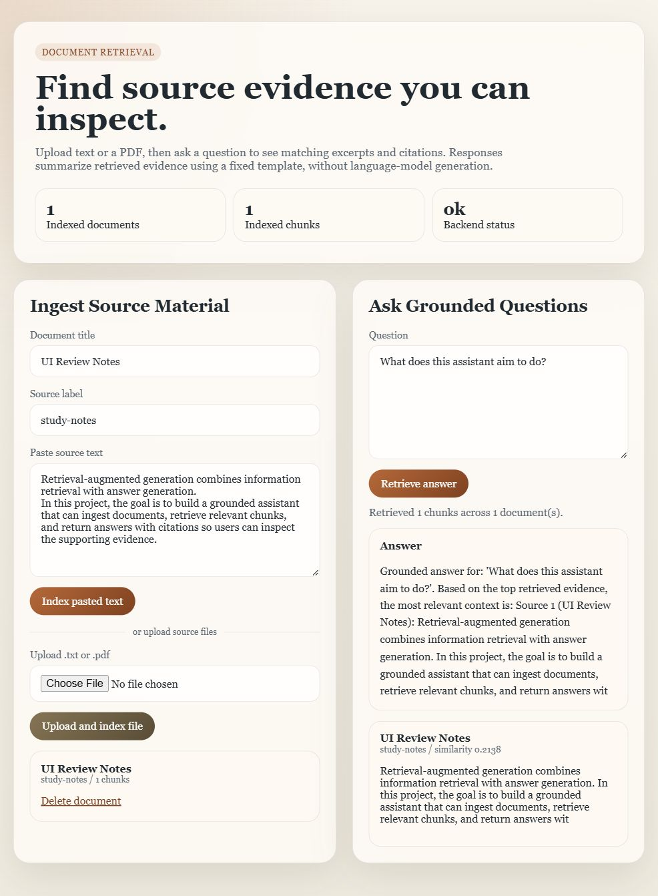

# AI RAG Assistant

A study project for inspecting document retrieval: upload text or a PDF, ask a question, and inspect the matching excerpts and source citations.



## Current Status

The app persists documents and overlapping chunks, embeds them, and ranks evidence for a question. Responses use a fixed excerpt template; **LLM answer generation is not implemented**. The default offline embedder hashes words and does not understand meaning. Optional OpenAI embeddings provide a separate vector space and require an API key.

The deployment target is a **private, single-workspace Docker Compose host**. There is no public hosted demo. Everyone with access to the app can read, add, query, and delete the shared collection. Keep it on localhost, behind an SSH tunnel, or behind an authenticated HTTPS gateway. It is not suitable for anonymous public access or multiple independent users.

## Features And Tradeoffs

- Paste text or upload UTF-8 `.txt` and text-based `.pdf` files.
- Inspect citation titles, labels, excerpts, and cosine similarity scores.
- Store documents and chunks in SQLite locally or PostgreSQL with pgvector in Compose.
- Manage schema changes through Alembic; reject incompatible embedding profiles.
- Limit uploads to 5 MiB, PDFs to 100 pages, and extracted text to 100,000 characters.
- Delete a document and its chunks through `DELETE /documents/{id}` (or `/api/documents/{id}` through the UI server).

FastAPI and Pydantic validate API inputs; SQLAlchemy owns persistence; Next.js, React, and TypeScript provide the UI. Python dependencies are locked in `backend/uv.lock`, and frontend dependencies in `frontend/package-lock.json`. Containers use Python 3.13 and Node 24. Next.js proxies `/api` to FastAPI so browser assets do not need a deployment-specific API URL.

## Architecture

```text
Browser -> Next.js /api proxy -> FastAPI -> SQLAlchemy -> SQLite / PostgreSQL
                                   |
                    extract -> normalize -> chunk -> embed -> store
                    question -> embed -> rank -> excerpt template + citations
```

PostgreSQL ranks vectors in SQL using pgvector and has an HNSW index. SQLite loads chunks and ranks them in Python, which is simpler for local testing but scales poorly. Embeddings are fixed at 128 dimensions by the schema. [Architecture notes](docs/architecture.md) explain compatibility and retrieval limitations.

## Run With Docker

Prerequisite: Docker Engine/Desktop with Compose v2 and Linux containers. From a clean checkout:

```powershell
git clone https://github.com/YangOwen007/ai-rag-assistant.git
cd ai-rag-assistant
./scripts/configure.ps1
docker compose up --build -d
docker compose ps
./scripts/smoke.ps1
```

On Linux/macOS, use `sh scripts/configure.sh` instead of the PowerShell configure script. Open [127.0.0.1:3000](http://127.0.0.1:3000). Use this IPv4 address because Compose binds IPv4 loopback; `localhost` may resolve to another IPv6 listener on Windows. If port 3000 is occupied, change `APP_PORT` in root `.env` and supply that port to `scripts/smoke.ps1 -BaseUrl`. No database port is published, so other projects can continue using port 5432.

The configure script creates an ignored `.env` containing a randomly generated database password. Never paste it into an issue or commit it. Startup waits for PostgreSQL, runs migrations, then checks backend readiness. [Deployment guide](docs/deployment.md) covers updates, verification, backups, rollback, and remote access.

## Develop Without Docker

Install Python 3.13, Node 24, and [uv](https://docs.astral.sh/uv/getting-started/installation/) 0.10.7 or newer. Run from two terminals:

```powershell
cd backend
uv sync --frozen --extra dev
uv run alembic upgrade head
uv run uvicorn app.main:app --host 127.0.0.1 --port 8000 --reload
```

```powershell
cd frontend
npm ci
npm run dev
```

For a local production build, use `npm run build` followed by `npm start -- --hostname 127.0.0.1`. The backend production start command is `uv run uvicorn app.main:app --host 127.0.0.1 --port 8000 --no-access-log`. Apply migrations before starting it.

## Configuration

Root `.env` configures Compose; `backend/.env` optionally configures non-container development. Templates live in root, backend, and frontend `.env.example` files.

| Variable | Purpose | Required |
| --- | --- | --- |
| `POSTGRES_PASSWORD` | Random URL-safe hex password for Compose database | Compose |
| `APP_PORT` | Host loopback port, default 3000 | No |
| `RAG_DATABASE_URL` | SQLite path or `postgresql+psycopg` URL; Compose sets it | No for local SQLite |
| `RAG_EMBEDDING_PROVIDER` | `deterministic` (default) or `openai` | No |
| `RAG_OPENAI_API_KEY` | Server-side embedding credential | OpenAI mode only |
| `RAG_OPENAI_EMBEDDING_MODEL` | Default `text-embedding-3-small` | No |
| `RAG_EMBEDDING_DIMENSIONS` | Must be 128; schema changes require migration | No |
| `RAG_ALLOWED_ORIGINS` | JSON origin list for direct backend access | No |
| `API_INTERNAL_URL` | Next.js build-time proxy target; Compose sets it | No |

Changing providers or models requires exporting, deleting, and re-ingesting existing documents. Old process-random embeddings are marked `legacy` by the migration; the API refuses to mix them with new vectors. Back up existing data before upgrading. Do not stamp a migration onto an older database with existing tables without inspecting its schema first.

## Verification

```powershell
cd backend
uv run --extra dev pytest -q
uv run --extra dev ruff check .
uv run --extra dev pip-audit
```

```powershell
cd frontend
npm ci
npm run typecheck
npm run build
npm audit
```

CI runs these checks and scans Git history for secrets. Container integration checks use a disposable Compose database. Sample files in `eval/` are proposed cases, not benchmark results; there is no measured retrieval accuracy claim.

## Security And Privacy

Source text, filenames, titles, and embeddings persist in the database. Original uploaded files are not retained, and there is no analytics integration. OpenAI mode sends source chunks and questions to that provider; deterministic mode makes no model calls. Do not upload sensitive documents to a shared demonstration instance. Document deletion does not erase database backups or third-party retention. Protect and expire backups separately.

The app has no login, per-user authorization, rate limiter, storage quota, or isolated PDF worker. Size limits reduce common mistakes but do not make hostile PDF parsing safe. Use a trusted private workspace. [Security policy](SECURITY.md) describes reporting and deployment boundaries.

## Known Limitations And Next Steps

- No LLM generation, OCR, hybrid search, reranker, relevance threshold, or retrieval benchmark.
- Character windows can split words; citation excerpts may truncate important context.
- Ingestion is synchronous; parsing and embeddings occupy worker threads.
- Authentication, quotas, rate limits, parser isolation, and user-owned documents are required before public access.
- Backups, access controls, monitoring, and HTTPS hosting are operator responsibilities.

The next useful product step is a small retrieval evaluation corpus, followed by evidence-based retrieval improvements. Licensing has not been selected; no license grant is implied by publishing the repository.
